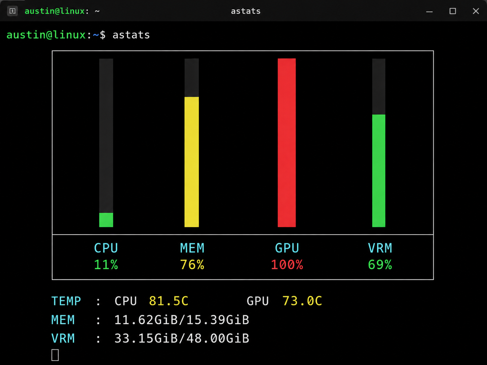

# stats

Small terminal monitor for AMD/Linux systems showing:

- CPU usage
- Memory usage
- GPU usage
- VRAM usage
- CPU temperature
- GPU temperature



## Requirements

- Linux
- AMD GPU exposing `/sys/class/drm/card*/device/*` metrics
- C++17 compiler (`g++`)
- `make`

## Build

```bash
make
```

## Run

```bash
./astats
```

Press `Ctrl+C` to exit.

## Notes

- Data sources: `/proc` and `/sys` (no external libraries required)
- GPU/VRAM/temperature fields show `unavailable` if your kernel/driver does not expose a metric
